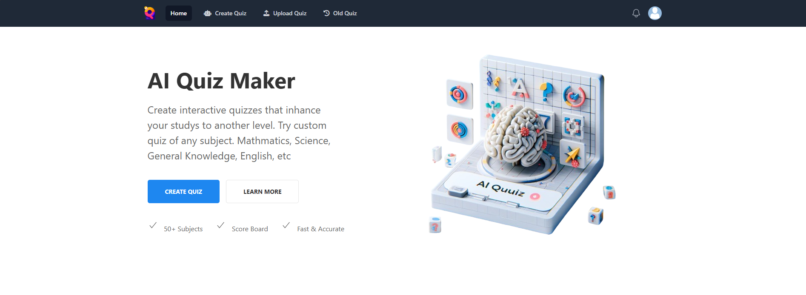
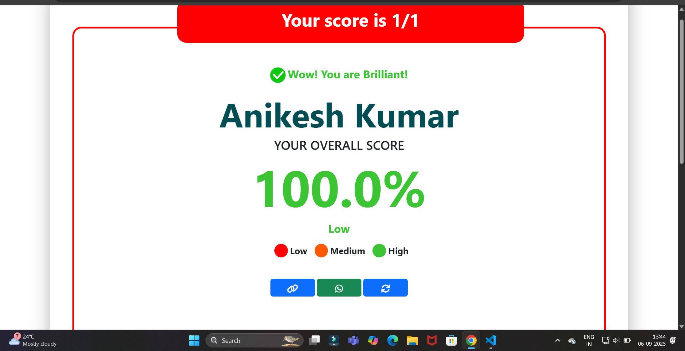
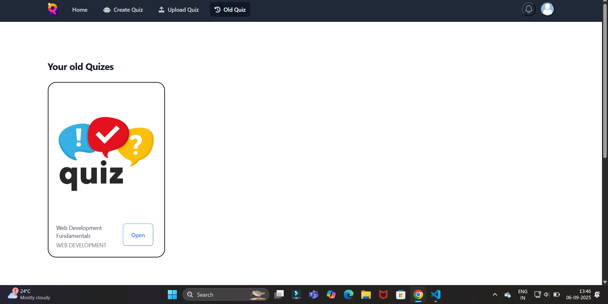
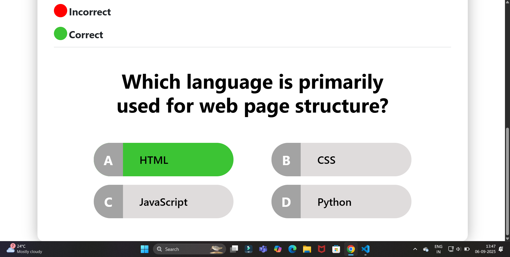
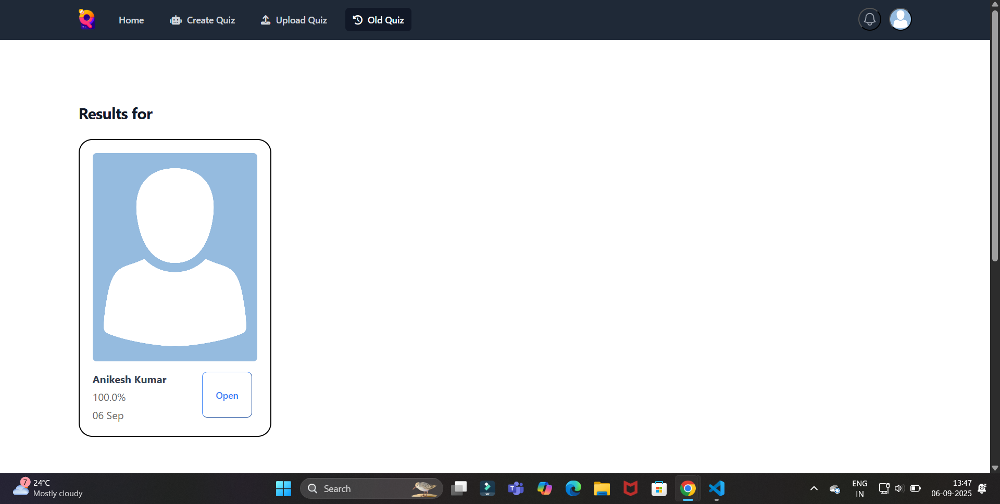

# Motivation:
In todays life manually genertaing quizzes is very difficult for teachers in this regular test schedules. Also students face lask of high quality practise material content.
So this quiz generator can be used very effectively for revision purposes to students as it geneartes any subjects,custom difficulty with as much amount of questions you want for revision. Also teachers can use this as platform to conduct quizzes to as it inbulit with feature og anticheating if detected test auto-submits there only.

# AI Quiz Generator

An intelligent web application that leverages Google's Gemini API to automatically generate interactive quizzes on any subject. This project is built with Python and the Flask web framework

    
  
  
  
  
  

## About The Project

The AI Quiz Generator is a dynamic platform for creating and taking quizzes.Users can generate custom quizzes by specifying the subject, topic, difficulty level, and number of questions. The application then uses the Gemini API to generate relevant and challenging questions.This tool is perfect for students who want to test their knowledge, teachers who need to create assessments, or anyone looking for a fun and interactive way to learn.

## Key Features

*   AI-Powered Quiz Generation**: Automatically creates quizzes using the powerful Google Gemini API. 
*   Customizable Quizzes**: Tailor quizzes by defining the subject, topic, difficulty, and number of questions. 
*   Multiple Question Types**: Supports both multiple-choice and true/false questions.
*   Interactive Quiz Experience**: A clean and intuitive interface for taking quizzes.
*   Instant Feedback and Results**: View your score and the correct answers immediately after completing a quiz.
*   Quiz History**: Access and retake previously generated quizzes.
*   User-Friendly Interface**: Simple and easy to navigate for a seamless user experience.
*   Included anticheat detection mechanisms to avoid cheating during quiz so also can be used as a platform to for organizing test.

## Built With

*   Flask: A lightweight WSGI web application framework in Python.
*   Google Generative AI: For state-of-the-art AI model access.
*   HTML/CSS/JavaScript: For the frontend user interface.
*   JSON: For data storage and exchange.

#Thankyou
