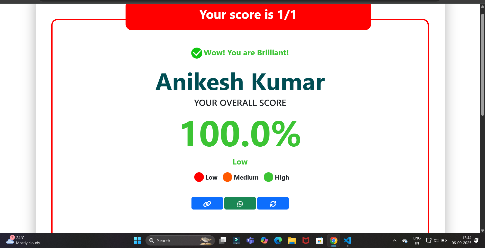
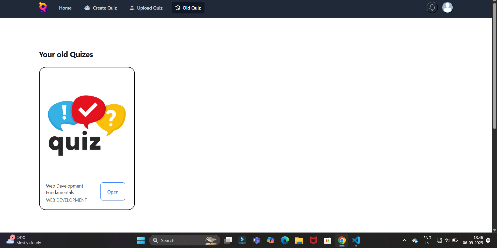
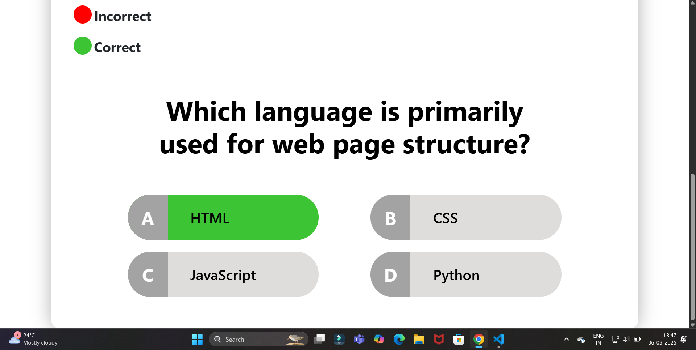
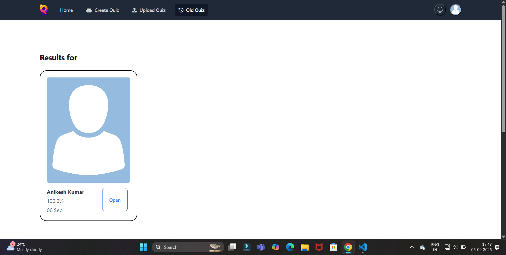

# AI Quiz Generator

An intelligent web application that leverages Google's Gemini API to automatically generate interactive quizzes on any subject. This project is built with Python and the Flask web framework.

    
  
  
  
  
  


## Table of Contents

- [About The Project](#about-the-project)
- [Key Features](#key-features)
- [Built With](#built-with)
- [Getting Started](#getting-started)
  - [Prerequisites](#prerequisites)
  - [Installation](#installation)
- [Usage](#usage)
- [Project Structure](#project-structure)
- [Contributing](#contributing)
- [License](#license)

## About The Project

The AI Quiz Generator is a dynamic platform for creating and taking quizzes. [12] Users can generate custom quizzes by specifying the subject, topic, difficulty level, and number of questions. The application then uses the Gemini API to generate relevant and challenging questions. [18] This tool is perfect for students who want to test their knowledge, teachers who need to create assessments, or anyone looking for a fun and interactive way to learn.

## Key Features

*   **AI-Powered Quiz Generation**: Automatically creates quizzes using the powerful Google Gemini API. [18]
*   **Customizable Quizzes**: Tailor quizzes by defining the subject, topic, difficulty, and number of questions. [2]
*   **Multiple Question Types**: Supports both multiple-choice and true/false questions. [3]
*   **Interactive Quiz Experience**: A clean and intuitive interface for taking quizzes.
*   **Instant Feedback and Results**: View your score and the correct answers immediately after completing a quiz. [3]
*   **Quiz History**: Access and retake previously generated quizzes.
*   **User-Friendly Interface**: Simple and easy to navigate for a seamless user experience.

## Built With

*   [Flask](https://flask.palletsprojects.com/): A lightweight WSGI web application framework in Python. [15]
*   [Google Gemini API](https://ai.google.dev/): For state-of-the-art AI model access.
*   HTML/CSS/JavaScript: For the frontend user interface.
*   JSON: For data storage and exchange.

## Getting Started

To get a local copy up and running follow these simple steps.

### Prerequisites

*   Python 3.6+
*   pip

### Installation

1.  **Clone the repository:**
    ```sh
    git clone https://github.com/your-username/ai-quiz-generator.git
    cd ai-quiz-generator
    ```

2.  **Create and activate a virtual environment:**
    ```sh
    python -m venv venv
    source venv/bin/activate  # On Windows use `venv\Scripts\activate`
    ```

3.  **Install the required packages:**
    ```sh
    pip install -r requirements.txt
    ```

4.  **Get your Google Gemini API key:**
    *   Visit the [Google AI for Developers](https://ai.google.dev/) website to get your API key.
    *   Add your API key to the `app.py` file:
        ```python
        gemini_api_key = 'YOUR_API_KEY'
        ```

5.  **Run the application:**
    ```sh
    flask run
    ```
    The application will be running at `http://127.0.0.1:5000/`.

## Usage

1.  Navigate to the homepage to create a new quiz.
2.  Fill in the desired course/subject, topic, level of difficulty, and number of questions.
3.  Click "Make It" to generate your quiz.
4.  Share the generated quiz link with others or take it yourself.
5.  After completing the quiz, you will see your score and the correct answers.
6.  You can view your past quizzes in the "Old Quizzes" section.

## Project Structure

```
.
├── app.py              # Main Flask application logic
├── db/                 # Directory for JSON-based data storage
│   ├── no.json           # Counter for generating unique quiz URLs
│   ├── quiz/           # Directory to store individual quiz data files
│   │   └── ...
│   ├── quiz_meta.json  # Metadata and index for all created quizzes
│   └── result.json     # Stores the results of completed quizzes
├── static/             # Contains static assets (CSS, client-side JS, images)
│   └── ...
├── templates/          # Contains all Jinja2 HTML templates for the frontend
│   ├── create.html     # Page for creating a new quiz
│   ├── index.html      # The landing/home page
│   ├── old.html        # Page to display a user's past quizzes
│   ├── quiz.html       # The main quiz-taking interface
│   ├── quiz.js         # JavaScript logic dynamically generated for each quiz
│   ├── result.html     # Page to display quiz results and feedback
│   └── stats.html      # Page to show statistics for a specific quiz
└── requirements.txt    # Lists the Python dependencies for the project
```
## Contributing
Contributions are what make the open-source community such an amazing place to learn, inspire, and create. Any contributions you make are **greatly appreciated**.
If you have a suggestion that would make this better, please fork the repo and create a pull request. You can also simply open an issue with the tag "enhancement".
1.  Fork the Project
2.  Create your Feature Branch (`git checkout -b feature/AmazingFeature`)
3.  Commit your Changes (`git commit -m 'Add some AmazingFeature'`)
4.  Push to the Branch (`git push origin feature/AmazingFeature`)
5.  Open a Pull Request

